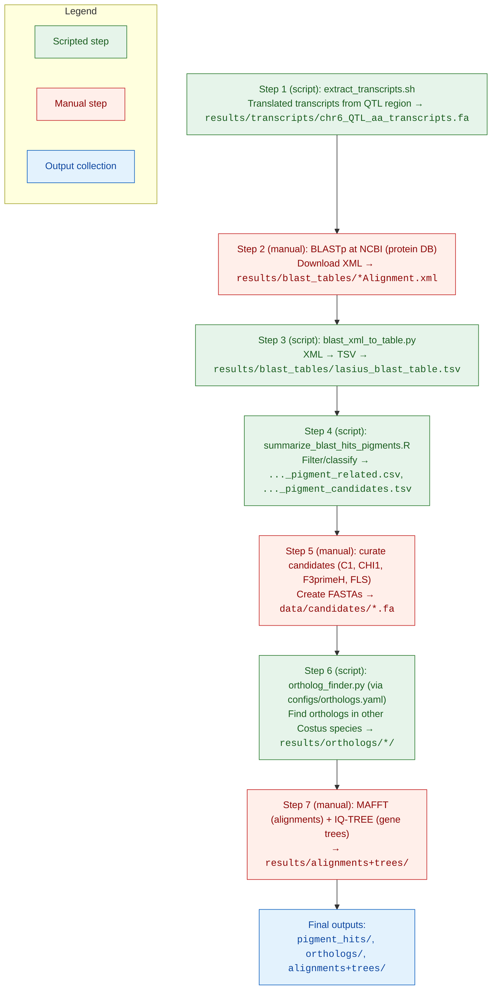

# Costus Pigment Candidates

This repository documents my work identifying candidate genes involved in floral pigment variation in *Costus*.

---
## Purpose

In previous work, we identified a major QTL associated with the presence/absence of nectar guides, with cyanidin (an anthocyanin pigment) implicated as the compound underlying this trait. The goal of this project is to pinpoint and evaluate candidate genes in the anthocyanin biosynthetic pathway that fall within this QTL region. 

To do this, I extracted and translated transcripts from the *C. lasius* QTL region, searched them against protein databases to identify pigment-related genes, and narrowed down to four strong candidates (C1, CHI1, F3'H, F3H/FLS). These candidates were then used to identify putative orthologs in other *Costus* species (*C. bracteatus*, *C. allenii*, *C. pulverulentus*). Alignments and phylogenetic trees of these orthologs provide a comparative framework for evaluating the evolutionary history of pigment-related genes across the genus.

---
## Repository Contents

```
costus-pigment-candidates/
├── data/               # Input datasets (genome annotation, candidate lists, references)
├── scripts/            # Python, bash, and R scripts used in analyses
├── results/            # Outputs (see below)
├── config/             # Configuration files (paths, tool settings)
└── README.md           # Project documentation (this file)
```

### Results directory
- pigment_hits/ - Filtered candidate gene hits from BLAST.
- blast_tables/ - Raw BLAST results in tabular format.
- blastdb/ - Local BLAST databases built from reference sequences.
- orthologs/ - Ortholog groupings of candidate genes.
- alignments+trees/ - Multiple sequence alignments and phylogenetic trees.
- transcripts/ - Extracted transcript sequences for candidate genes.

---
## Data Sources

All reference genomes and annotations used in this analysis were obtained from public repositories:

- *Costus lasius*  
  - Genome: [NCBI GenBank GCA_027563935.2](https://www.ncbi.nlm.nih.gov/datasets/genome/GCA_027563935.2/)  
    - File used: `Genomes/C.lasius_genome_NCBI.fasta`  
    - Note: the processed version of this genome is different from the NCBI version in that the chromosomes have been renamed
  - Annotation: [OSF repository](https://osf.io/2ap4k/files/osfstorage?view_only=6b8f5ff7d2ae499b871e1b1fb6fe6219)  
    - File used: `Annotations/Lasius_annotation.gff3`  
    - Note: the processed version of this annotation is different from the OSF version in that the chromosomes have been renamed to match the genome file

- *Costus allenii*  
  - Genome: [OSF repository](https://osf.io/2ap4k/files/osfstorage?view_only=6b8f5ff7d2ae499b871e1b1fb6fe6219)  
    - File used: `Genomes/Costus_allenii.fasta`  
  - Annotation: [OSF repository](https://osf.io/2ap4k/files/osfstorage?view_only=6b8f5ff7d2ae499b871e1b1fb6fe6219)  
    - File used: `Annotations/Allenii_annotation.gff3`  

- *Costus bracteatus*  
  - Genome: [OSF repository](https://osf.io/2ap4k/files/osfstorage?view_only=6b8f5ff7d2ae499b871e1b1fb6fe6219)  
    - File used: `Genomes/Costus_bracteatus.fasta`  
  - Annotation: [OSF repository](https://osf.io/2ap4k/files/osfstorage?view_only=6b8f5ff7d2ae499b871e1b1fb6fe6219)  
    - File used: `Annotations/Brac_annotation.gff3`  

- *Costus pulverulentus*  
  - Genome: [OSF repository](https://osf.io/2ap4k/files/osfstorage?view_only=6b8f5ff7d2ae499b871e1b1fb6fe6219)  
    - File used: `Genomes/GCA_027562315.1_ASM2756231v1_genomic.fna`  
  - Annotation: [OSF repository](https://osf.io/2ap4k/files/osfstorage?view_only=6b8f5ff7d2ae499b871e1b1fb6fe6219)  
    - File used: `Annotations/Pulv_annotation.gff3`

---
## Dependencies
This project mixes Python, R, and external CLI tools.

### Python (required)
- Python **3.8+** (tested with 3.12)
- Packages:
  - `PyYAML` (used in `ortholog_finder.py`)
  - `biopython` (for `Bio.Blast.NCBIXML` in `blast_xml_to_table.py`)

**Install (pip):**
```bash
pip install pyyaml biopython
```

### R (required for summarization step)
- `Rscript`
- Packages
  - `dplyr`	
  - `stringr`
  - `readr`

### External command-line tools (required)
- **Blast+** (provides `makeblastdb`, `blastn`) -- used in `ortholog_finder.py`
  - `conda install bioconda::blast`
- **gffread** -- used in `extract_transcripts.sh` and `ortholog_finder.py`
  - `https://github.com/gpertea/gffread`
---
## Outputs
The typical end products are:
- A curated set of *Costus* pigment candidate genes (`pigment_hits/`)
- Putative ortholog sequences across *Costus* species for comparative and evolutionary analyses (`orthologs/`)

---
## Workflow Diagram



---
## Analysis Workflow

Below is the sequence of steps I used to identify pigment-related candidate genes in *Costus*. Some steps are automated with scripts in this repository, while others were performed manually or with external tools.

---
### Step 1. Extract translated transcripts from QTL region

**Script:** `scripts/extract_transcripts.sh`

Generates translated (amino acid) transcripts from the *C. lasius* genome within the QTL region on chromosome 6.
```
scripts/extract_transcripts.sh \
  --genome C.lasius_genome_NCBI.fasta \
  --gff Lasius_annotation.renamed.gff3 \
  --region Chrom6:3343495-4962302 \
  --out-prefix chr6_QTL \
  --outdir results/transcripts/ \
# Optional: add --gffread-cmd /path/to/gffread if gffread is not on PATH
```

**Output:**
`results/transcripts/chr6_QTL_aa_transcripts.fa`

---
### Step 2. BLAST search against protein database

**No script available**

Manually submitted the translated transcripts to NCBI BLASTp (online tool).

- Website: https://blast.ncbi.nlm.nih.gov/Blast.cgi?PAGE=Proteins
- Downloaded results in XML format.

**Output:**
`results/blast_tables/0G799C6R013-Alignment.xml`

---
### Step 3. Convert BLAST XML to table

**Script:** `scripts/blast_xml_to_table.py`

Converts BLAST XML output to a tab-delimited table.

```
python scripts/blast_xml_to_table.py \
  results/blast_tables/0G799C6R013-Alignment.xml \
  results/lasius_
```

**Output:**
`results/blast_tables/lasius_blast_table.tsv`

---
### Step 4. Summarize BLAST hits

**Script:** `scripts/summarize_blast_hits_pigments.R`

Classifies BLAST hits as pigment-related and produces filtered lists.

```
Rscript scripts/summarize_blast_hits_pigments.R \
  --input results/blast_tables/lasius_blast_table.tsv \
  --filtered-out results/pigment_hits/lasius_blast_hits_pigment_related.csv \
  --best-out results/pigment_hits/lasius_blast_hits_pigment_candidates.tsv
```

**Outputs:**
- `results/pigment_hits/lasius_blast_hits_pigment_related.csv`
- `results/pigment_hits/lasius_blast_hits_pigment_candidates.tsv`

---
### Step 5. Identify candidate transcripts

**No script available**

From BLAST results, identified four pigment-related candidate genes: C1, CHI1, F3′H, FLS.

Created FASTA files for each transcript in C. lasius and stored in data/candidates/:

- `data/candidates/C_lasius_C1_transcript.fa`
- `data/candidates/C_lasius_CHI1_transcript.fa`
- `data/candidates/C_lasius_F3primeH_transcript.fa`
- `data/candidates/C_lasius_FLS_transcript.fa`

---
### Step 6. Find orthologs in other Costus species

**Script:** `scripts/ortholog_finder.py`

Automates discovery of orthologs in other reference genomes (*C. allenii*, *C. bracteatus*, *C. pulverulentus*).

`python3 scripts/ortholog_finder.py --config configs/orthologs.yaml`


The YAML config specifies:
- Path to `gffread`
- Paths to candidate nucleotide FASTAs (from *C. lasius*)
- Paths to genomes + annotations for the other *Costus* species
- Output directory path

**Outputs:**
- `results/orthologs/<species>/` directories
	- nucleotide transcripts
	- amino acid translations

---
### Step 7. Alignment and tree building

**No script available**

- Used **MAFFT** (online) for multi-species alignments.
- Used **IQ-TREE** to generate gene trees.

**Outputs:**
Stored in: `results/alignments+trees/`