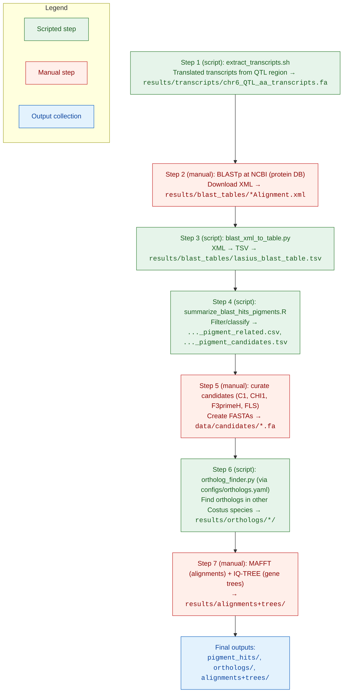

# Costus Pigment Candidates

This repository documents my work identifying candidate genes involved in floral pigment variation in Costus.

## Purpose

In previous work, we identified a major QTL underlying the presence/absence of nectar guides. The pigment involved was identified as cyanidin, a product of the anthocyanin biosynthetic pathway. The aim of this project is to identify and evaluate candidate genes in the anthocyanin biosynthetic pathway that are located within the QTL region. The analyses here combine genome annotation, curated gene lists, BLAST searches, ortholog inference, and phylogenetic trees to generate a working set of pigment candidates.

## Repository Contents

costus-pigment-candidates/
├── data/               # Input datasets (genome annotation, candidate lists, references)
├── scripts/            # Python, bash, and R scripts used in analyses
├── results/            # Outputs (see below)
├── config/             # Configuration files (paths, tool settings)
└── README.md           # Project documentation (this file)

## Results directory
- pigment_hits/ - Filtered candidate gene hits from BLAST.
- blast_tables/ - Raw BLAST results in tabular format.
- blastdb/ - Local BLAST databases built from reference sequences.
- orthologs/ - Ortholog groupings of candidate genes.
- alignments+trees/ - Multiple sequence alignments and phylogenetic trees.
- transcripts/ - Extracted transcript sequences for candidate genes.

## Outputs
The typical end products are:
- A curated set of Costus pigment candidate genes (pigment_hits/)
- Supporting orthologs for downstream evolutionary analyses

## Notes
Analyses were run with Python 3.12 and standard genomics tools (e.g., BLAST+, gffread, AGAT).

Not all intermediate files are versioned here; some large raw data are external.

## Workflow Diagram

